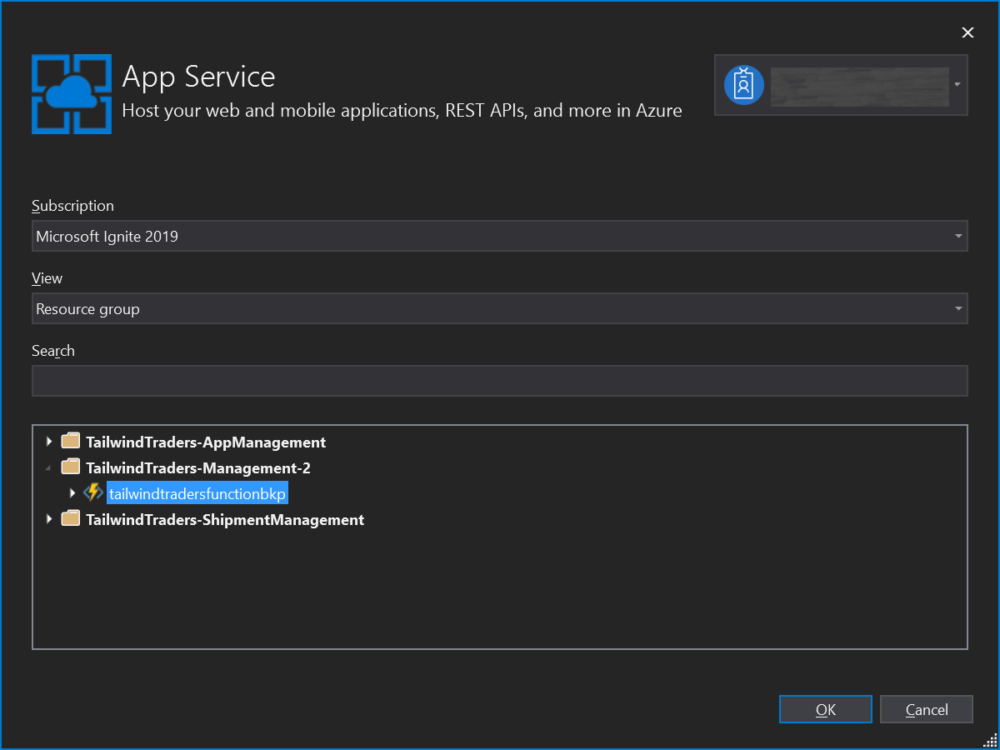
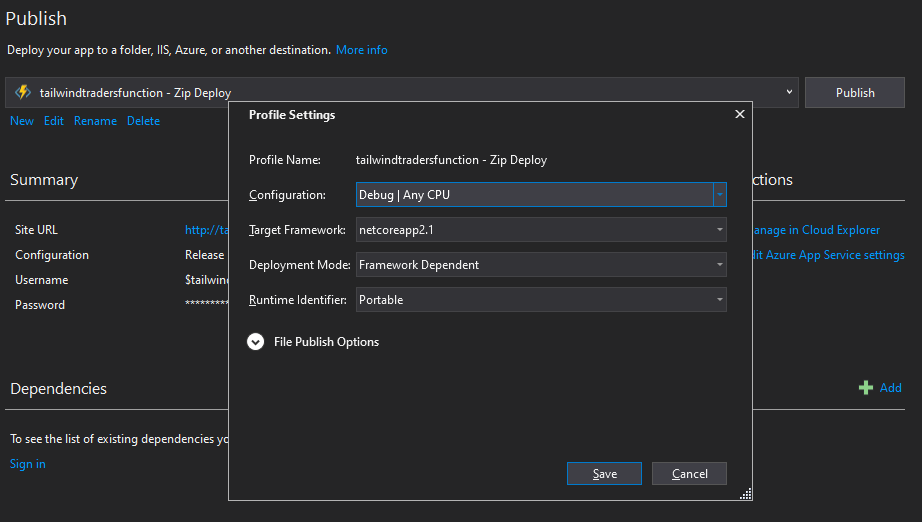
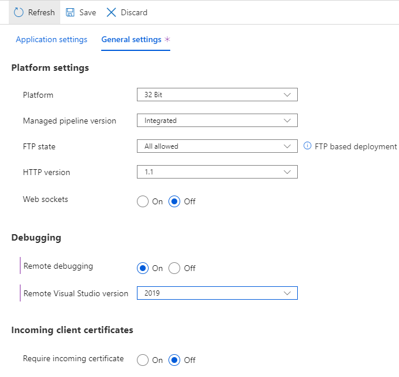
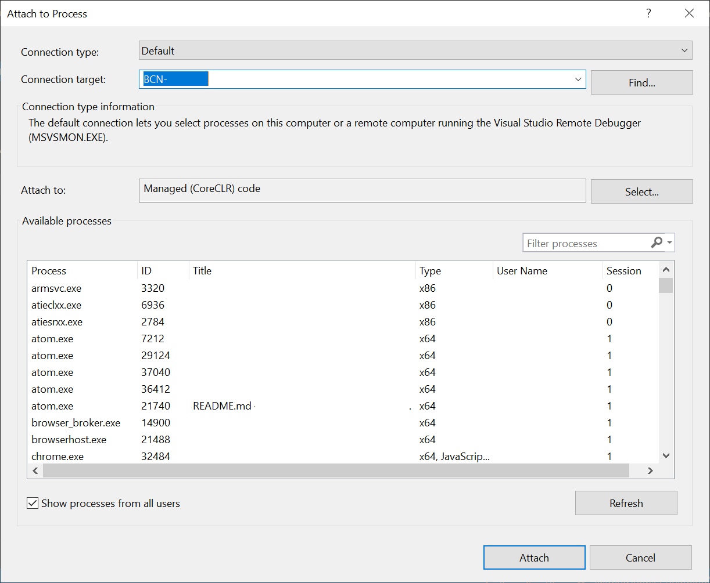

## Post-Deploy Configuration

Once the deployment of the resources has finished, you will only need to configure a few settings.

### Link Azure Function to Form recognizer
When the Form Recognizer resource is created, it generates a key that will be used in the Azure Function.

##### Step 1: Get Form Recognizer key
- Go to Azure portal and access to Form Recognizer resource.
- In the section Resource Management, go to option **Quick start**.
- **Key1** value is the parameter that we will need to provide to the Azure Function.

> Note: *Endpoint* parameter has been already set up in the function during the deployment process.

##### Step 2: Set Form Recognizer key in Azure Function Settings
- Go to Azure portal and access to Azure Function resource.
- Go to tab **Platform features**.
- In the section General Settings, go to option **Configuration**.
- Set the key obtained in the previous section in the setting **FormRecognizedSubscriptionKey**:

### Set CosmosDb key in Logic App CosmosDb connection
When the CosmosDb resource is created, it generates a key that will be used in the Logic App connection.

##### Step 1: Get CosmosDb key
- Go to Azure portal and access to CosmosDb resource.
- In the section Settings, go to option **Keys**.
- **Primary Key** value is the parameter that we will need to provide to the connection.

##### Step 2: Set CosmosDb key in Logic App connection
- Go to Azure portal and access to connection resource, named **cosmosconnection**.
- In the section General, go to option **Edi API connection**.
- Set the key obtained in the previous section in the parameter **Access Key to your Azure Cosmos DB account**:

# Form Recognizer
The behavior of Form Recognizer tries to find a model to analyze the image provided.
If the model does not exists yet, the solution trains three times with the images located in the corresponding container of the storage. That's usually enough to recognize a model and get the data.
If the recognition of the data is not successful, you can train your model more times or/and use a larger data set of images in the training.

>Note: Models needs to have certain requirements in order to get analyzed by the Form Recognizer service. Check the detailed information on the requirements in [here](https://docs.microsoft.com/en-us/azure/cognitive-services/form-recognizer/build-training-data-set).

# Walkthrough: Debug Azure Function
The following guide covers the step by step of how to deploy a application function to Azure in order to debug Azure functions remotely.

## Before you begin

1. You will need **Visual Studio 2017 or later**.
2. You will need an Azure Subscription in order to follow this guide.
4. Solution deployed and configurated on **Azure**.

## Publishing Guide
### Step 1: Open the Azure Function Solution
You can publish your function app to Azure directly from Visual Studio.

Clone the repository and open the **Source** folder, there you will find the **TailwindTraders.ShippingManagement.sln**. Open the solution and right-click on the project called **TailwindTraders.ShippingManagement**. Go to Publish and then click on **Start**.

### Step 2: Publish your function to Azure
In the **Pick a publish target** dialog, select **Publish target** and then **Select Existing**. Click over button **Create Profile**.

In the **App Service** screen, select your **Subscription**. You have to select, from the tree view control, the **Resource** and the **Azure Function app** which will be publish. Click **Ok** for accept changes.

In the **Publish** screen, on **Summary** section change **Configuration** from `Release` to `Debug`. To publish the Azure function, click over **Publish** button.

### Step 3: Enable remote debugging on Azure

Once Azure function was published, to enabling remote debugging on Azure, please follow the next steps:

Access to [Azure Portal](https://portal.azure.com/), navigate to deployed Azure Function and select **Configuration** link.

In **Configuration** section navigate to **General Settings**. On section named **Debugging**, checks `On` in **Remote debugging** to allow it and select the **Visual Studio version**. Save the changes.

### Step 4: Download publish profile from Azure

Navigate to Azure Function main page, download publish profile file clicking in **Get publish profile**.

- `userName`: User name to connect to Azure Function.
- `userPwd`: Password to connect to Azure Function.
- `destinationAppUrl`: Endpoint url.

### Step 5: Attach Visual Studio Debugger to application

In Visual Studio, On the **Debug** menu choose **Attach to Process..** item

On **Attach to Process..** dialog, click on the **Select...** button and un-tick everything except `Managed (CoreCLR) code`.

In the **Connection target** enter the `destinationAppUrl` (without the preceding http) and followed by **4022** port. You should now see an **Enter Your Credentials** popup box, use the `userName` (with domain) and `userPWD` values from downloaded file, click **Ok** to accept changes.

Wait a moment for Visual Studio to do its, then click the **w3wp.exe** process and the click the **Attach** button. Be patient after clicking as it may take quite a while for all the debug symbols to load.

### Step 6: Debug

In code, set your breakpoints as desired. Invoke your function code and you should see your breakpoint hit.

Once again this may take a while so be patient, you may also see `a remote operation is taking longer than expected`. Finally the execution stops in your first breakpoint.

