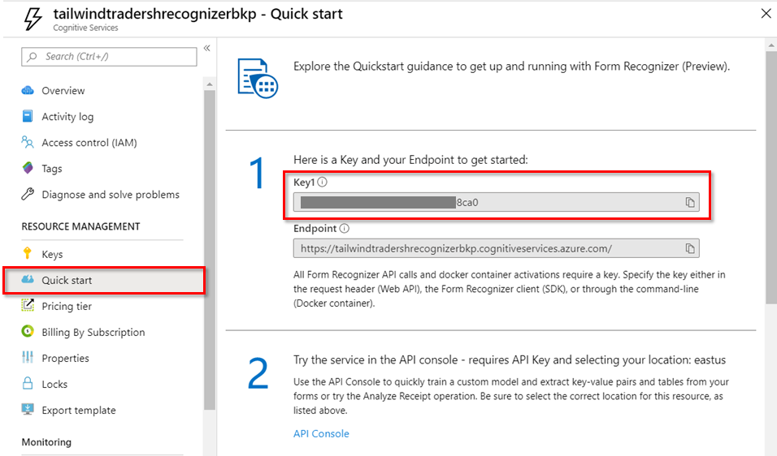
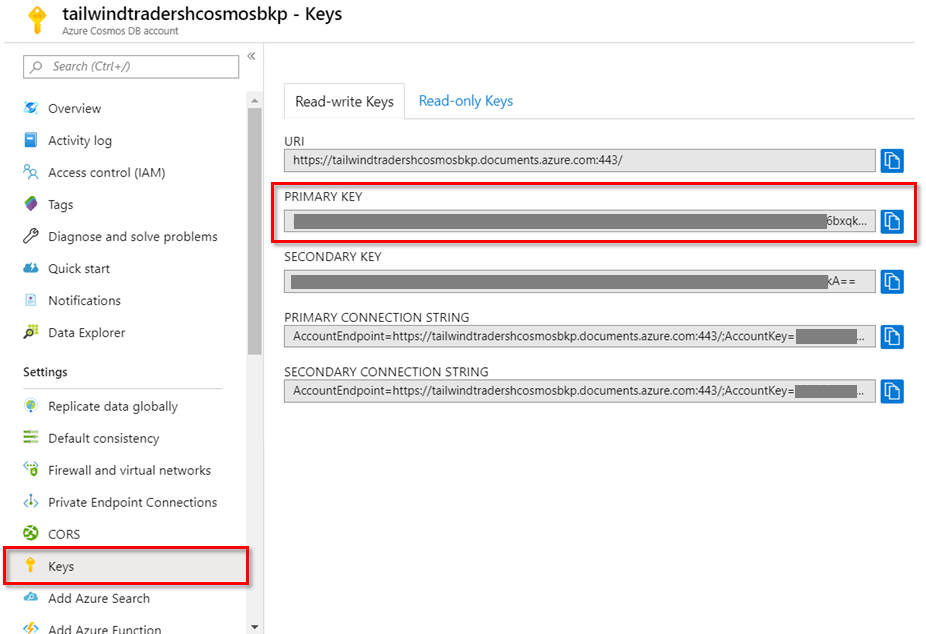
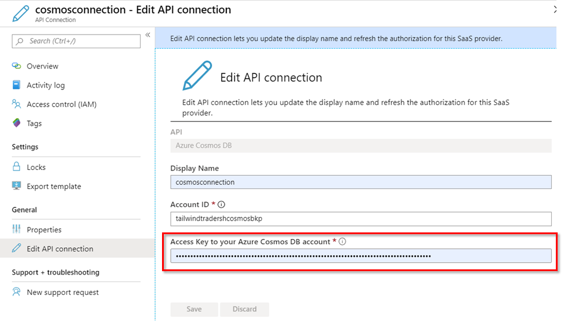
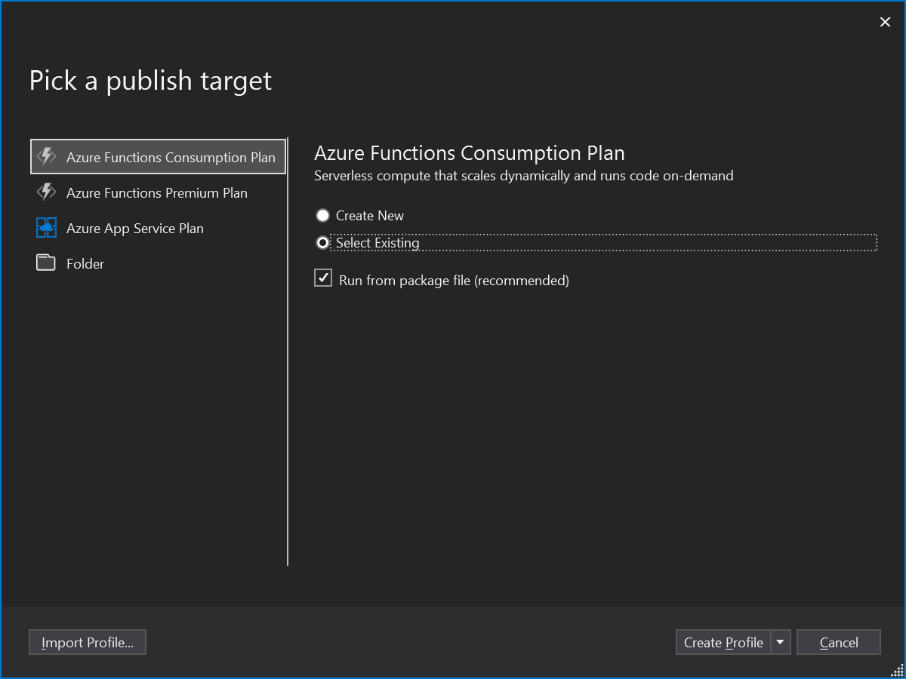
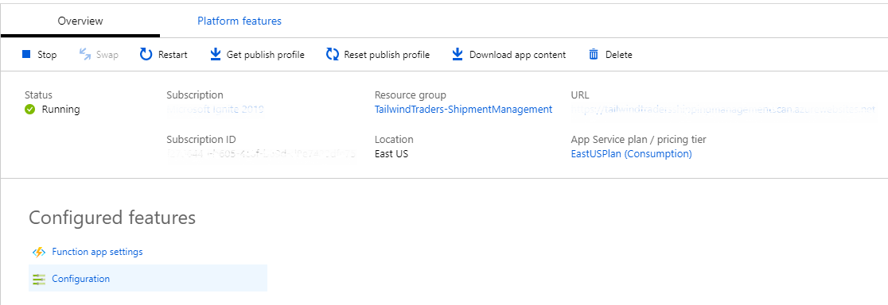
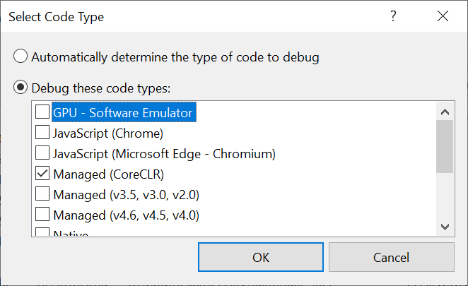
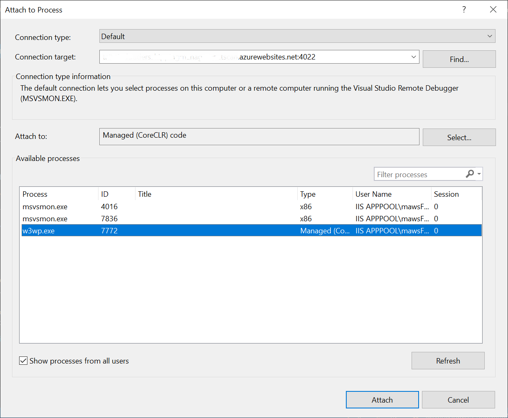
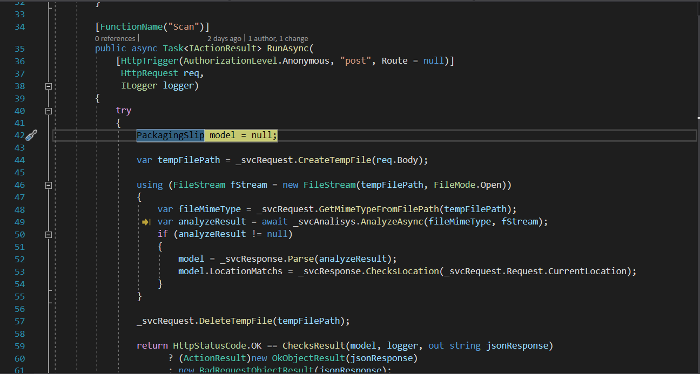

# Tailwind Traders Management App


Tailwind Traders Management App is a sample app created using Power Apps with the main goal of connect a easy creation app model to serverless solutions within [Azure](https://azure.microsoft.com/products/powerapps).
The goal of the app is to upload a packaging slip document using the Power Apps, send the image to an Azure Function and analyze the data using Form Recognizer Services. The function will return a model to the app and the final user would modify, if needed, the data received. The last step is store the data received and modified in CosmosDb using a Logic App.

# Repositories

In this repository we will find different solutions:

- Power Apps zip package solution.
- Swagger files to configure custom connectors.
- Azure Function Code.
- Deploy section, containing the Deploy solution and the ARM templates of the resources used.

## Before you begin

You will need to set up some features before deploy the solution to Azure:

1. You will need an Azure Subscription in order to follow this demo script.
2. Tailwind Traders App Management source code.
3. Form Recognizer Access.
4. Azure CLI. [Information](https://docs.microsoft.com/en-us/cli/azure/install-azure-cli-windows?view=azure-cli-latest).
5. PowerShell.

> Note:  In the time of writing Form Recognizer is still in preview. In order to deploy the solution or the resource individually you will need to request access previously. You can see the detailed information of Form Recognizer in this [link](https://azure.microsoft.com/en-us/services/cognitive-services/form-recognizer/).
Also you can request access to the resource in this [link](https://forms.office.com/Pages/ResponsePage.aspx?id=v4j5cvGGr0GRqy180BHbRyj5DlT4gqZKgEsfbkRQK5xUMjZVRU02S1k4RUdLWjdKUkNRQVRRTDg1NC4u).

Additionally, in order to debug the Azure Function you will need:
1. You will need Visual Studio 2017 or later.

# Deployment scenarios

## Import Power App 

To import the Power App you will need to follow [this guide](https://docs.microsoft.com/en-us/power-platform/admin/environment-and-tenant-migration#importing-an-app).

## Deploy using one script
You can deploy the scenario using one script under `/Deploy` folder.
Running the following command you can deploy starting with the infrastructure and ending with deploying the images on the storage:

```
.\Deploy-Unified.ps1 -resourceGroup <resource-group-name> -location <location> -clientId <service-principal-id> -password <service-principal-password> -subscription <subscription-id> -prefixName <prefix-name>
```

- `resourceGroup`: The name of your resource group where all infrastructure will be created `Required`
- `location`: Select where you want to create your resource group. (i.e., East US) `Required`
- `subscription`: Id of your subscription where you are going to deploy your resource group `Required`
- `prefixName`: The name to refer the resources to be deployed. It will be composed with the following format: *prefixname-resourcetype-resourceGroupNameEncoded* (i.e., if you enter as a prefix name: tailwind, Azure Function resource name will become: *tailwindfunction12875156*). `Required`

The resources that will be deployed are:
- Azure Function.
- Premium Hosting Plan.
- Storage.
- Form Recognizer.
- CosmosDb.
- Logic App.
- CosmosDb connection.
- Application Insight.

The deployment will configure the logic app connection, will publish the assets for training the Form Recognizer in the storage and will deploy the Azure Function code.

## Post-Deploy Configuration

Once the deployment of the resources has finished, you will only need to configure a few settings:

### Link Azure Function to Form recognizer
When the Form Recognizer resource is created, it generates a key that will be used in the Azure Function.

##### Step 1: Get Form Recognizer key
- Go to Azure portal and access to Form Recognizer resource.
- In the section Resource Management, go to option **Quick start**.
- **Key1** value is the parameter that we will need to provide to the Azure Function.




> Note: *Endpoint* parameter has been already set up in the function during the deployment process.

##### Step 2: Set Form Recognizer key in Azure Function Settings
- Go to Azure portal and access to Azure Function resource.
- Go to tab **Platform features**.
- In the section General Settings, go to option **Configuration**.
- Set the key obtained in the previous section in the setting **FormRecognizedSubscriptionKey**:


### Set CosmosDb key in Logic App CosmosDb connection
When the CosmosDb resource is created, it generates a key that will be used in the Logic App connection.

##### Step 1: Get CosmosDb key
- Go to Azure portal and access to CosmosDb resource.
- In the section Settings, go to option **Keys**.
- **Primary Key** value is the parameter that we will need to provide to the connection.




##### Step 2: Set CosmosDb key in Logic App connection
- Go to Azure portal and access to connection resource, named **cosmosconnection**.
- In the section General, go to option **Edi API connection**.
- Set the key obtained in the previous section in the parameter **Access Key to your Azure Cosmos DB account**:



# Form Recognizer
The behavior of Form Recognizer tries to find a model to analyze the image provided.
If the model does not exists yet, the solution trains three times with the images located in the corresponding container of the storage. That's usually enough to recognize a model and get the data.
If the recognition of the data is not successful, you can train your model more times or/and use a larger data set of images in the training.

>Note: Models needs to have certain requirements in order to get analyzed by the Form Recognizer service. Check the detailed information on the requirements in [here](https://docs.microsoft.com/en-us/azure/cognitive-services/form-recognizer/build-training-data-set).

# Walkthrough: Debug Azure Function
The following guide covers the step by step of how to deploy a application function to Azure in order to debug Azure functions remotely.

## Before you begin

1. You will need **Visual Studio 2017 or later**.
2. You will need an Azure Subscription in order to follow this guide.
4. Solution deployed and configurated on **Azure**.


## Publishing Guide
### Step 1: Open the Azure Function Solution
You can publish your function app to Azure directly from Visual Studio.

Clone the repository and open the **Source** folder, there you will find the **TailwindTraders.ShippingManagement.sln**. Open the solution and right-click on the project called **TailwindTraders.ShippingManagement**. Go to Publish and then click on **Start**.


### Step 2: Publish your function to Azure
In the **Pick a publish target** dialog, select **Publish target** and then **Select Existing**. Click over button **Create Profile**.



In the **App Service** screen, select your **Subscription**. You have to select, from the tree view control, the **Resource** and the **Azure Function app** which will be publish. Click **Ok** for accept changes.


In the **Publish** screen, on **Summary** section change **Configuration** from `Release` to `Debug`. To publish the Azure function, click over **Publish** button.


### Step 3: Enable remote debugging on Azure

Once Azure function was published, to enabling remote debugging on Azure, please follow the next steps:

Access to [Azure Portal](https://portal.azure.com/), navigate to deployed Azure Function and select **Configuration** link.



In **Configuration** section navigate to **General Settings**. On section named **Debugging**, checks `On` in **Remote debugging** to allow it and select the **Visual Studio version**. Save the changes.


### Step 4: Download publish profile from Azure

Navigate to Azure Function main page, download publish profile file clicking in **Get publish profile**.


- `userName`: User name to connect to Azure Function.
- `userPwd`: Password to connect to Azure Function.
- `destinationAppUrl`: Endpoint url.


### Step 5: Attach Visual Studio Debugger to application

In Visual Studio, On the **Debug** menu choose **Attach to Process..** item


On **Attach to Process..** dialog, click on the **Select...** button and un-tick everything except `Managed (CoreCLR) code`.



In the **Connection target** enter the `destinationAppUrl` (without the preceding http) and followed by **4022** port. You should now see an **Enter Your Credentials** popup box, use the `userName` (with domain) and `userPWD` values from downloaded file, click **Ok** to accept changes.

Wait a moment for Visual Studio to do its, then click the **w3wp.exe** process and the click the **Attach** button. Be patient after clicking as it may take quite a while for all the debug symbols to load.



### Step 6: Debug

In code, set your breakpoints as desired. Invoke your function code and you should see your breakpoint hit.

Once again this may take a while so be patient, you may also see `a remote operation is taking longer than expected`. Finally the execution stops in your first breakpoint.



## Contributing

This project welcomes contributions and suggestions.  Most contributions require you to agree to a
Contributor License Agreement (CLA) declaring that you have the right to, and actually do, grant us
the rights to use your contribution. For details, visit https://cla.opensource.microsoft.com.

When you submit a pull request, a CLA bot will automatically determine whether you need to provide
a CLA and decorate the PR appropriately (e.g., status check, comment). Simply follow the instructions
provided by the bot. You will only need to do this once across all repos using our CLA.

This project has adopted the [Microsoft Open Source Code of Conduct](https://opensource.microsoft.com/codeofconduct/).
For more information see the [Code of Conduct FAQ](https://opensource.microsoft.com/codeofconduct/faq/) or
contact [opencode@microsoft.com](mailto:opencode@microsoft.com) with any additional questions or comments.
